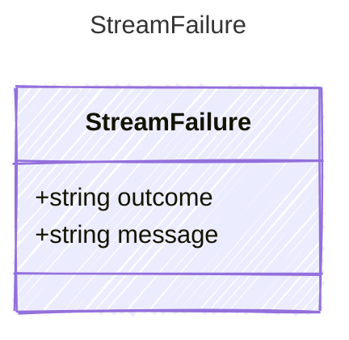

<!-- <auto-generated by typra-emitter> -->

A classified terminal failure from an LLM response stream.

## Class Diagram



## Yaml Example

```yaml
outcome: indeterminate
message: "SSE stream error: connection reset"
```

## Properties

| Name | Type | Description |
| ---- | ---- | ----------- |
| outcome | string | Whether the provider outcome is known or requires reconciliation |
| message | string | The human-readable failure message |
