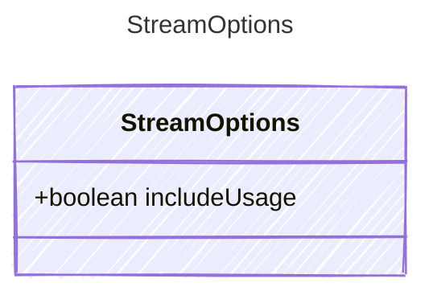

<!-- <auto-generated by typra-emitter> -->

Options controlling streaming behavior for LLM API calls.
Passed alongside the model options when streaming is enabled.

## Class Diagram



## Yaml Example

```yaml
includeUsage: true
```

## Properties

| Name | Type | Description |
| ---- | ---- | ----------- |
| includeUsage | boolean | When true, the final streaming chunk includes token usage statistics |
