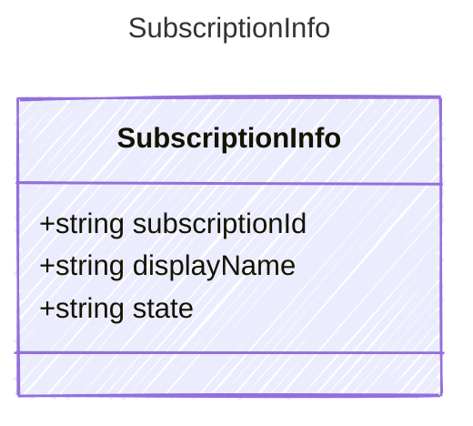

<!-- <auto-generated by typra-emitter> -->

A cloud subscription or account boundary available to the authenticated user.

## Class Diagram

## Properties

| Name | Type | Description |
| ---- | ---- | ----------- |
| subscriptionId | string | Stable provider subscription identifier |
| displayName | string | Human-readable subscription name |
| state | string | Provider-reported lifecycle state |
