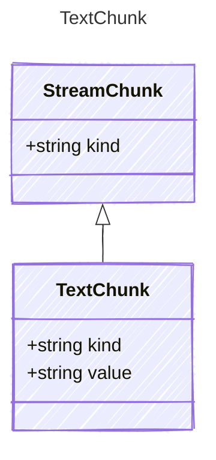

A text content chunk from the LLM response stream.

## Class Diagram



## Yaml Example

```yaml
value: Hello
```

## Properties

| Name | Type | Description |
| ---- | ---- | ----------- |
| kind | string | The kind identifier for text chunks |
| value | string | The text content of the chunk |
