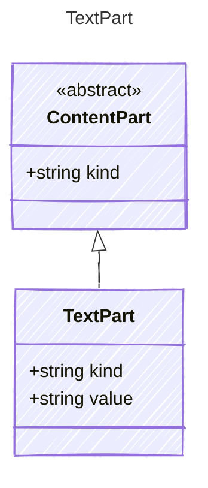

A text content part.

## Class Diagram



## Yaml Example

```yaml
value: Hello, world!
```

## Properties

| Name | Type | Description |
| ---- | ---- | ----------- |
| kind | string | The kind identifier for text content |
| value | string | The text content |
