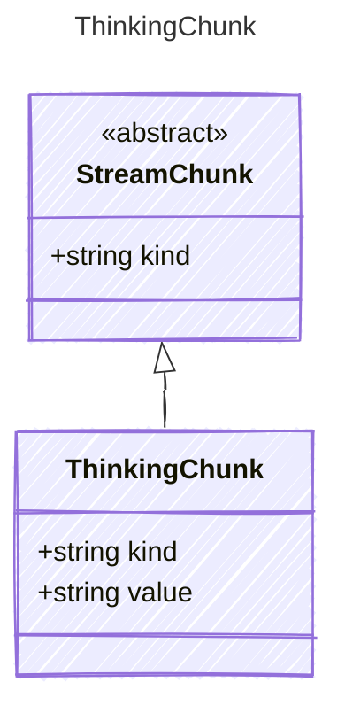

<!-- <auto-generated by typra-emitter> -->

A thinking/reasoning content chunk from the LLM response stream.

## Class Diagram



## Yaml Example

```yaml
value: Let me consider...
```

## Properties

| Name | Type | Description |
| ---- | ---- | ----------- |
| kind | string | The kind identifier for thinking chunks |
| value | string | The thinking content of the chunk |
