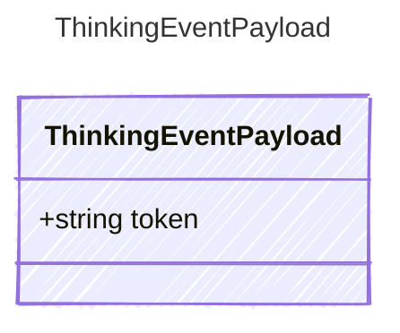

<!-- <auto-generated by typra-emitter> -->
---
title: "ThinkingEventPayload"
description: "Documentation for the ThinkingEventPayload type."
slug: "reference/thinkingeventpayload"
---

Payload for "thinking" events — reasoning/chain-of-thought tokens.

## Class Diagram



## Yaml Example

```yaml
token: Let me consider...
```

## Properties

| Name | Type | Description |
| ---- | ---- | ----------- |
| token | string | The thinking/reasoning token text |
