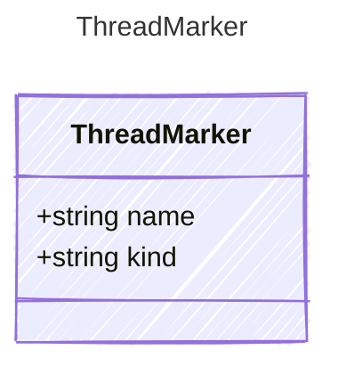

<!-- <auto-generated by typra-emitter> -->
---
title: "ThreadMarker"
description: "Documentation for the ThreadMarker type."
slug: "reference/threadmarker"
---

Positional marker for conversation history insertion during template rendering.

During `prepare()`, nonce strings in rendered text are replaced with
ThreadMarker objects. The pipeline then replaces them with actual
conversation messages from the inputs.

## Class Diagram



## Yaml Example

```yaml
name: thread
kind: thread
```

## Properties

| Name | Type | Description |
| ---- | ---- | ----------- |
| name | string | The input property name (e.g. 'conversation') |
| kind | string | The rich kind ('thread', 'image', 'file', 'audio') |
