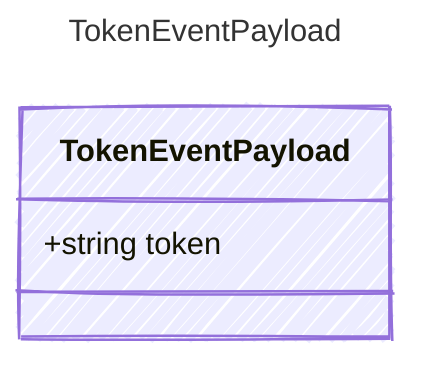

<!-- <auto-generated by typra-emitter> -->
---
title: "TokenEventPayload"
description: "Documentation for the TokenEventPayload type."
slug: "reference/tokeneventpayload"
---

Payload for "token" events — a single text token streamed from the LLM.

## Class Diagram



## Yaml Example

```yaml
token: Hello
```

## Properties

| Name | Type | Description |
| ---- | ---- | ----------- |
| token | string | The streamed token text |
