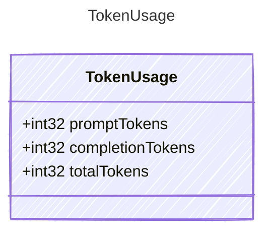

<!-- <auto-generated by typra-emitter> -->
---
title: "TokenUsage"
description: "Documentation for the TokenUsage type."
slug: "reference/tokenusage"
---

Tracks token consumption for a single LLM call. Provider-specific field
names (e.g., OpenAI's `prompt_tokens` vs Anthropic's `input_tokens`)
are mapped via `knownAs` augments in the wire directory.

## Class Diagram



## Yaml Example

```yaml
promptTokens: 150
completionTokens: 42
totalTokens: 192
```

## Properties

| Name | Type | Description |
| ---- | ---- | ----------- |
| promptTokens | int32 | Number of tokens in the prompt/input sent to the model |
| completionTokens | int32 | Number of tokens generated in the model's completion/output |
| totalTokens | int32 | Total tokens consumed (prompt + completion). May be provided by the API or computed. |
