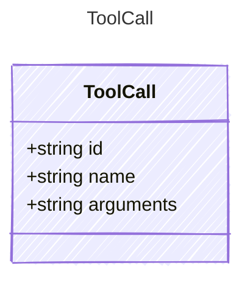

A tool call requested by the LLM. Contains the function name and serialized
arguments that should be dispatched to the appropriate tool handler.

## Class Diagram



## Yaml Example

```yaml
id: call_abc123
name: get_weather
arguments: '{"city": "Paris"}'
```

## Properties

| Name | Type | Description |
| ---- | ---- | ----------- |
| id | string | The unique identifier of the tool call |
| name | string | The name of the tool to call |
| arguments | string | The serialized JSON arguments for the tool call |
