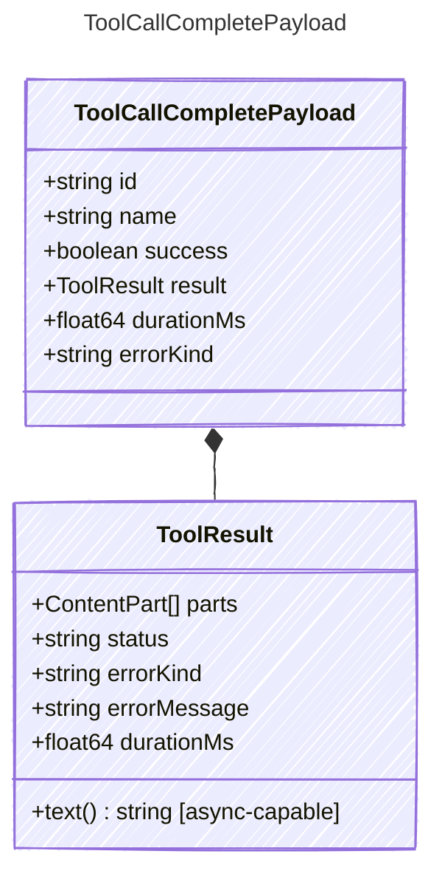

<!-- <auto-generated by typra-emitter> -->

Payload for "tool_call_complete" events — a tool dispatch finished.

## Class Diagram



## Yaml Example

```yaml
id: call_abc123
name: get_weather
success: true
durationMs: 42
errorKind: timeout
```

## Properties

| Name | Type | Description |
| ---- | ---- | ----------- |
| id | string | The unique identifier of the tool call |
| name | string | The name of the tool that completed |
| success | boolean | Whether the tool dispatch succeeded semantically |
| result | [ToolResult](../toolresult/) | Normalized tool result |
| durationMs | float64 | Tool execution duration in milliseconds |
| errorKind | string | Machine-readable error category when success is false |

## Composed Types

The following types are composed within `ToolCallCompletePayload`:

- [ToolResult](../toolresult/)
