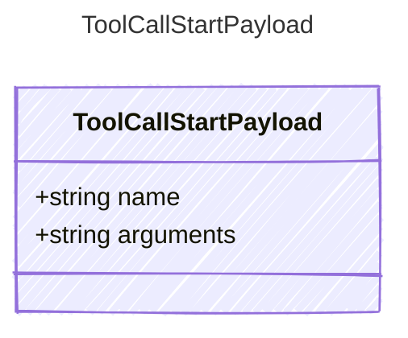

Payload for "tool_call_start" events — the LLM has requested a tool call.

## Class Diagram



## Yaml Example

```yaml
name: get_weather
arguments: '{"city": "Paris"}'
```

## Properties

| Name | Type | Description |
| ---- | ---- | ----------- |
| name | string | The name of the tool being called |
| arguments | string | The serialized JSON arguments for the tool call |
