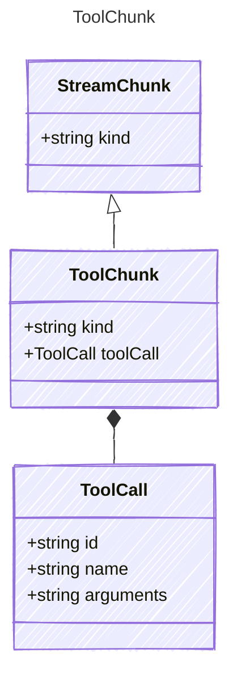

A tool call chunk from the LLM response stream.

## Class Diagram



## Yaml Example

```yaml
toolCall:
  id: call_abc123
  name: get_weather
  arguments: '{"city": "Paris"}'
```

## Properties

| Name | Type | Description |
| ---- | ---- | ----------- |
| kind | string | The kind identifier for tool chunks |
| toolCall | [ToolCall](../toolcall/) | The tool call data |

## Composed Types

The following types are composed within `ToolChunk`:

- [ToolCall](../toolcall/)
