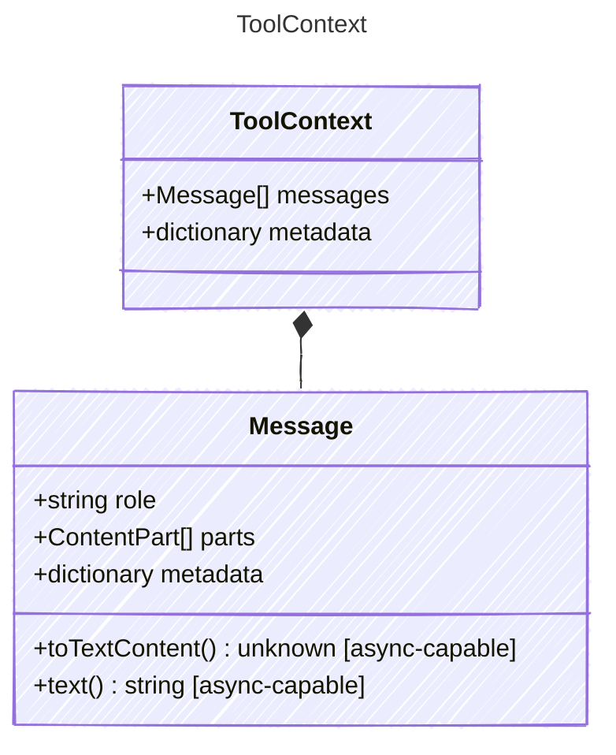

<!-- <auto-generated by typra-emitter> -->
---
title: "ToolContext"
description: "Documentation for the ToolContext type."
slug: "reference/toolcontext"
---

Context passed to tool handlers during agent loop execution. Provides
access to the agent configuration, current conversation state, and
arbitrary metadata for tool implementations that need broader context.

## Class Diagram



## Yaml Example

```yaml
metadata:
  userId: user-123
```

## Properties

| Name | Type | Description |
| ---- | ---- | ----------- |
| messages | [Message[]](../message/) | The current conversation messages at the point of tool invocation |
| metadata | dictionary | Optional metadata for tool-specific context (e.g., user session info) |

## Composed Types

The following types are composed within `ToolContext`:

- [Message](../message/)
