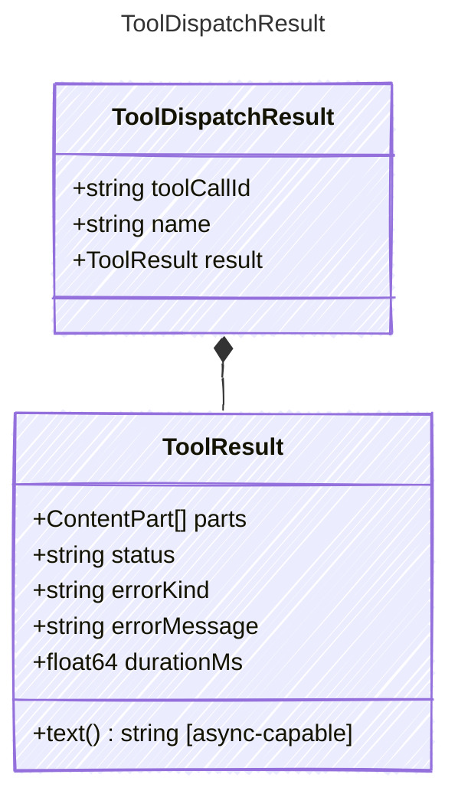

<!-- <auto-generated by typra-emitter> -->
---
title: "ToolDispatchResult"
description: "Documentation for the ToolDispatchResult type."
slug: "reference/tooldispatchresult"
---

The result of dispatching a single tool call. Pairs the tool call
identifier with the tool's name and result for correlation in the
agent loop's message assembly.

## Class Diagram



## Yaml Example

```yaml
toolCallId: call_abc123
name: get_weather
result:
  parts:
    - kind: text
      value: 72°F and sunny
```

## Properties

| Name | Type | Description |
| ---- | ---- | ----------- |
| toolCallId | string | The tool call ID from the LLM response, used to correlate results |
| name | string | The name of the tool that was called |
| result | [ToolResult](../toolresult/) | The result produced by the tool handler |

## Composed Types

The following types are composed within `ToolDispatchResult`:

- [ToolResult](../toolresult/)
