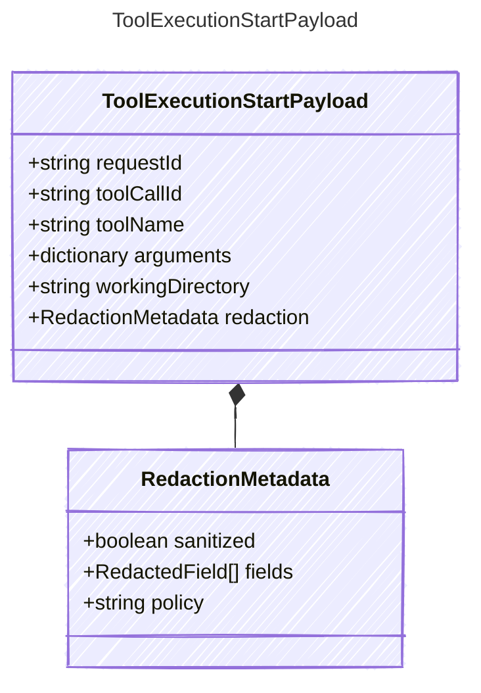

<!-- <auto-generated by typra-emitter> -->
---
title: "ToolExecutionStartPayload"
description: "Documentation for the ToolExecutionStartPayload type."
slug: "reference/toolexecutionstartpayload"
---

Payload for "tool_execution_start" events — the host is about to execute a concrete tool request.

This is distinct from "tool_call_start", which records the model requesting a tool.
Tool execution events capture the harness-side action after policy and permission checks.

## Class Diagram



## Yaml Example

```yaml
requestId: exec_abc123
toolCallId: call_abc123
toolName: powershell
workingDirectory: /workspace/project
```

## Properties

| Name | Type | Description |
| ---- | ---- | ----------- |
| requestId | string | Stable host execution request identifier |
| toolCallId | string | Associated model tool call identifier, when available |
| toolName | string | Name of the host tool being executed |
| arguments | dictionary | Tool arguments after host-side sanitization |
| workingDirectory | string | Working directory or execution scope for the tool |
| redaction | [RedactionMetadata](../redactionmetadata/) | Redaction state for sensitive argument fields |

## Composed Types

The following types are composed within `ToolExecutionStartPayload`:

- [RedactionMetadata](../redactionmetadata/)
