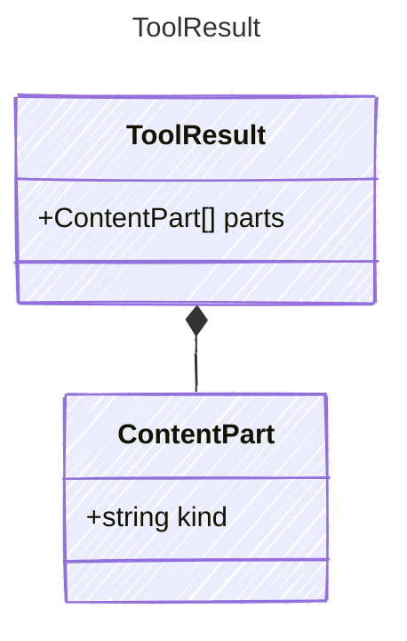

The result of a tool execution. Contains a list of content parts, enabling
rich tool results (text, images, files, audio) rather than just strings.

Implementations MUST support conversion from a plain string to a ToolResult
containing a single TextPart for backward compatibility.

## Class Diagram



## Yaml Example

```yaml
parts:
  - kind: text
    value: 72°F and sunny
```

## Properties

| Name | Type | Description |
| ---- | ---- | ----------- |
| parts | [ContentPart[]](../contentpart/) | The content parts of the tool result(Related Types: [TextPart](../textpart/), [ImagePart](../imagepart/), [FilePart](../filepart/), [AudioPart](../audiopart/)) |

## Composed Types

The following types are composed within `ToolResult`:

- [ContentPart](../contentpart/)
