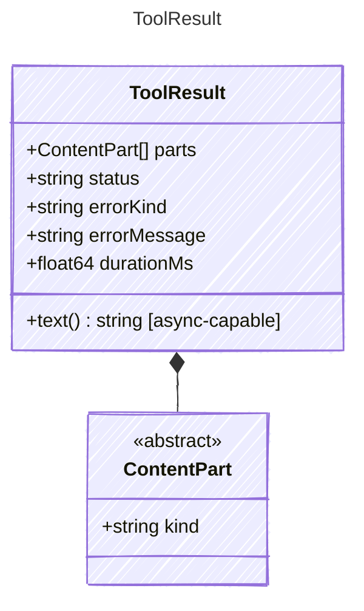

<!-- <auto-generated by typra-emitter> -->

The result of a tool execution. Contains a list of content parts, enabling
rich tool results (text, images, files, audio) rather than just strings.

Implementations MUST support conversion from a plain string to a ToolResult
containing a single TextPart for backward compatibility.

## Class Diagram



## Yaml Example

```yaml
parts:
  - kind: text
    value: 72°F and sunny
errorKind: missing_tool
errorMessage: Tool 'get_weather' is not registered
durationMs: 42
```

## Properties

| Name | Type | Description |
| ---- | ---- | ----------- |
| parts | [ContentPart[]](../contentpart/) | The content parts of the tool result(Related Types: [TextPart](../textpart/), [ImagePart](../imagepart/), [FilePart](../filepart/), [AudioPart](../audiopart/)) |
| status | string | Semantic execution status for the tool result |
| errorKind | string | Stable machine-readable error category when status is not success |
| errorMessage | string | Human-readable error message when status is not success |
| durationMs | float64 | Tool execution duration in milliseconds |

## Helper Methods

The following helper methods are declared via `@method` and must be implemented by every runtime. The schema declares the logical protocol contract; each runtime maps async-capable methods to idiomatic sync/async shapes for that language.

| Name | Signature | Runtime shape | Description |
| ---- | --------- | ------------- | ----------- |
| `text` | `text() -> string` | async-capable | Concatenate all TextPart values joined by newline |

## Factory Methods

The following factory methods are declared via `@factory` and are generated automatically by the emitter in every language.

- `text(value: string)`

## Composed Types

The following types are composed within `ToolResult`:

- [ContentPart](../contentpart/)
