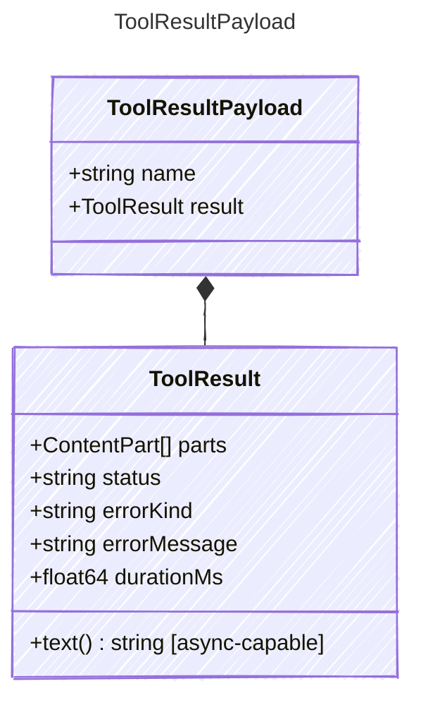

Payload for "tool_result" events — a tool has returned its result.

## Class Diagram



## Yaml Example

```yaml
name: get_weather
result:
  parts:
    - kind: text
      value: 72°F and sunny
```

## Properties

| Name | Type | Description |
| ---- | ---- | ----------- |
| name | string | The name of the tool that produced the result |
| result | [ToolResult](../toolresult/) | The tool's result |

## Composed Types

The following types are composed within `ToolResultPayload`:

- [ToolResult](../toolresult/)
