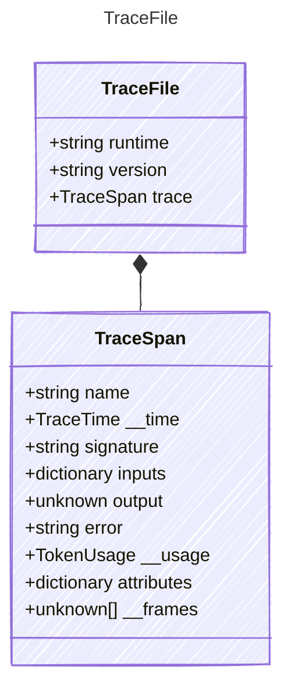

<!-- <auto-generated by typra-emitter> -->

The top-level .tracy file structure written by the file backend (§3.6.1).

## Class Diagram



## Yaml Example

```yaml
runtime: python
version: 2.0.0
```

## Properties

| Name | Type | Description |
| ---- | ---- | ----------- |
| runtime | string | Language/runtime name (e.g., 'python', 'csharp', 'javascript') |
| version | string | Prompty library version |
| trace | [TraceSpan](../tracespan/) | The root trace span |

## Composed Types

The following types are composed within `TraceFile`:

- [TraceSpan](../tracespan/)
