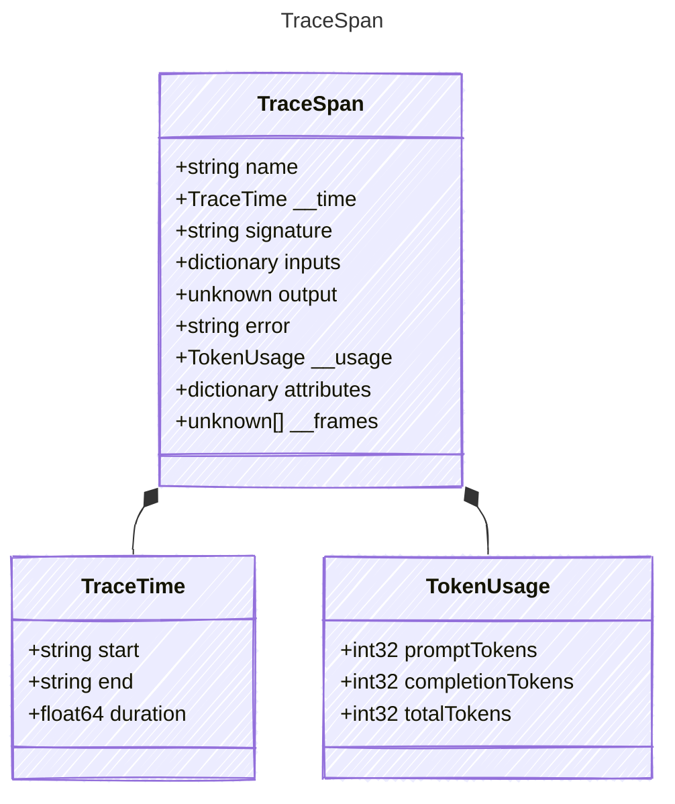

A single trace span capturing one pipeline stage or function invocation.
Spans nest via the `__frames` field to form a tree representing the
full execution (§3.6.1).

## Class Diagram



## Yaml Example

```yaml
name: prompty.core.pipeline.run
signature: prompty.core.pipeline.run
error: Connection refused
```

## Properties

| Name | Type | Description |
| ---- | ---- | ----------- |
| name | string | The name of this span (typically the function signature) |
| __time | [TraceTime](../tracetime/) | Timing information for this span |
| signature | string | Fully-qualified function signature that produced this span |
| inputs | dictionary | Serialized input parameters (redacted per §3.4) |
| output | unknown | Serialized return value or error information (redacted per §3.4) |
| error | string | Error message if the span ended with an exception |
| __usage | [TokenUsage](../tokenusage/) | Aggregated token usage hoisted from child spans (§3.5) |
| attributes | dictionary | Additional span attributes (e.g., OpenTelemetry GenAI attributes) |
| __frames | unknown[] | Nested child spans forming the execution tree (recursive; each element is a TraceSpan) |

## Composed Types

The following types are composed within `TraceSpan`:

- [TraceTime](../tracetime/)
- [TokenUsage](../tokenusage/)
