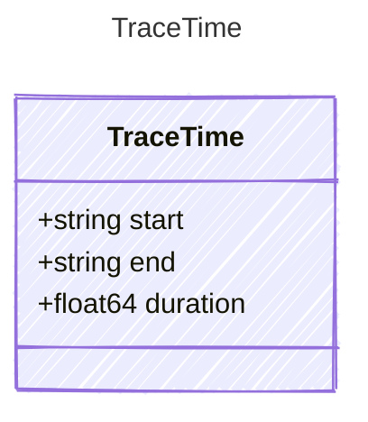

Timing information for a trace span.

## Class Diagram



## Yaml Example

```yaml
start: 2026-04-04T12:00:00Z
end: 2026-04-04T12:00:01Z
duration: 1000
```

## Properties

| Name | Type | Description |
| ---- | ---- | ----------- |
| start | string | ISO 8601 UTC timestamp when the span started |
| end | string | ISO 8601 UTC timestamp when the span ended |
| duration | float64 | Duration of the span in milliseconds |
