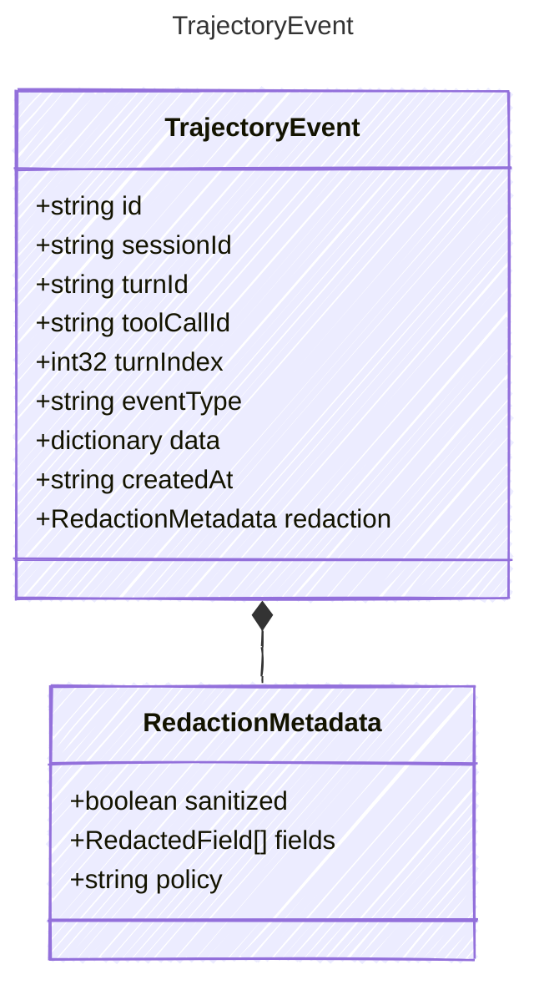

<!-- <auto-generated by typra-emitter> -->
---
title: "TrajectoryEvent"
description: "Documentation for the TrajectoryEvent type."
slug: "reference/trajectoryevent"
---

A compact, replay-oriented record of one harness-side action or observation.

## Class Diagram



## Yaml Example

```yaml
id: traj_abc123
sessionId: sess_abc123
turnId: turn_001
toolCallId: call_abc123
turnIndex: 4
eventType: command
createdAt: 2026-06-09T20:00:00Z
```

## Properties

| Name | Type | Description |
| ---- | ---- | ----------- |
| id | string | Stable trajectory event identifier |
| sessionId | string | Stable session identifier |
| turnId | string | Associated turn identifier, when available |
| toolCallId | string | Associated tool call identifier, when available |
| turnIndex | int32 | Zero-based turn index in the session |
| eventType | string | Host-defined trajectory event category |
| data | dictionary | Sanitized event data |
| createdAt | string | ISO 8601 UTC timestamp when the trajectory event was recorded |
| redaction | [RedactionMetadata](../redactionmetadata/) | Redaction state for sensitive trajectory fields |

## Composed Types

The following types are composed within `TrajectoryEvent`:

- [RedactionMetadata](../redactionmetadata/)
