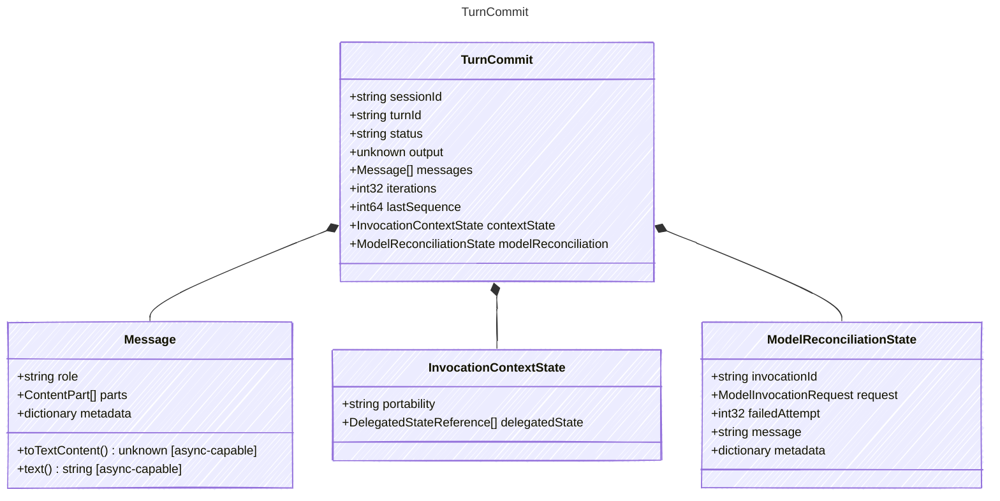

<!-- <auto-generated by typra-emitter> -->

The committed outcome of a turn handed to post-commit consumers.

## Class Diagram



## Yaml Example

```yaml
sessionId: sess_abc123
turnId: turn_abc123
```

## Properties

| Name | Type | Description |
| ---- | ---- | ----------- |
| sessionId | string | Stable session identifier |
| turnId | string | Stable turn identifier |
| status | string | Terminal status of the turn |
| output | unknown | Final output when the turn succeeded |
| messages | [Message[]](../message/) | Canonical conversation messages at commit time |
| iterations | int32 | Number of model loop iterations executed |
| lastSequence | int64 | Last committed event sequence for the turn |
| contextState | [InvocationContextState](../invocationcontextstate/) | Provider-context state carried out of the turn |
| modelReconciliation | [ModelReconciliationState](../modelreconciliationstate/) | Typed provider state when the commit requires model reconciliation |

## Composed Types

The following types are composed within `TurnCommit`:

- [Message](../message/)
- [InvocationContextState](../invocationcontextstate/)
- [ModelReconciliationState](../modelreconciliationstate/)
