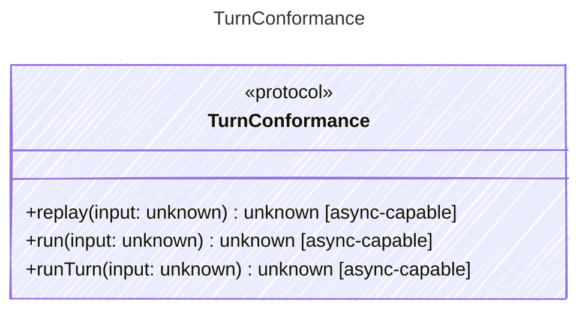

<!-- <auto-generated by typra-emitter> -->

Conformance-only seam that hosts the turn-engine behavior vectors: the agent
tool-calling loop against a scripted model, the turn engine's ordered typed
event stream, and the normalized replay journal. Each is validated
identically across every runtime.

This interface exists purely to carry

## Class Diagram

## Helper Methods

The following helper methods are declared via `@method` and must be implemented by every runtime. The schema declares the logical protocol contract; each runtime maps async-capable methods to idiomatic sync/async shapes for that language.

| Name | Signature | Runtime shape | Description |
| ---- | --------- | ------------- | ----------- |
| `replay` | `replay(input: unknown) -> unknown` | async-capable | Run a scenario and assert the normalized replay journal sequence |
| `run` | `run(input: unknown) -> unknown` | async-capable | Run the agent tool-calling loop against a scripted model to a final result |
| `runTurn` | `runTurn(input: unknown) -> unknown` | async-capable | Run a single turn and assert the ordered typed event stream it emits |
