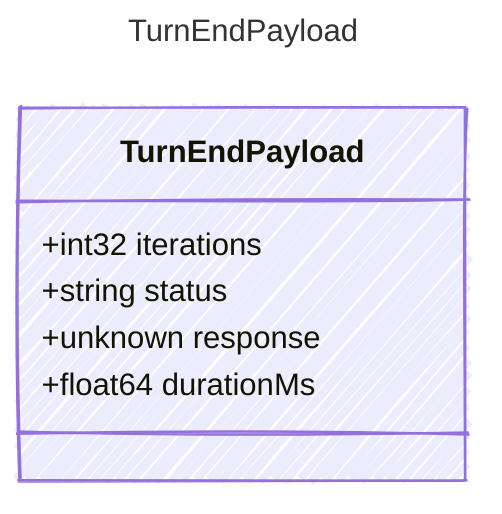

<!-- <auto-generated by typra-emitter> -->

Payload for "turn_end" events — a turn has completed.

## Class Diagram



## Yaml Example

```yaml
iterations: 2
durationMs: 1500
```

## Properties

| Name | Type | Description |
| ---- | ---- | ----------- |
| iterations | int32 | Number of tool-call iterations performed |
| status | string | Final semantic status of the turn |
| response | unknown | Final response after processing, if available |
| durationMs | float64 | Total elapsed turn duration in milliseconds |
