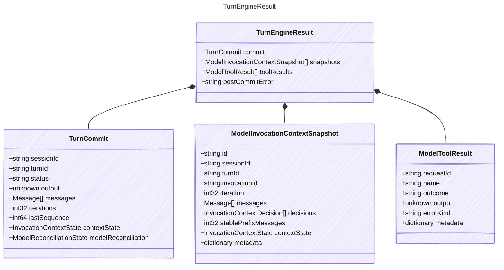

<!-- <auto-generated by typra-emitter> -->

The result returned by the turn engine.

## Class Diagram

## Properties

| Name | Type | Description |
| ---- | ---- | ----------- |
| commit | [TurnCommit](../turncommit/) | The committed turn outcome |
| snapshots | [ModelInvocationContextSnapshot[]](../modelinvocationcontextsnapshot/) | Immutable context snapshots produced during the turn |
| toolResults | [ModelToolResult[]](../modeltoolresult/) | Normalized tool results produced during the turn |
| postCommitError | string | A non-fatal post-commit failure; the turn itself remains committed |

## Composed Types

The following types are composed within `TurnEngineResult`:

- [TurnCommit](../turncommit/)
- [ModelInvocationContextSnapshot](../modelinvocationcontextsnapshot/)
- [ModelToolResult](../modeltoolresult/)
