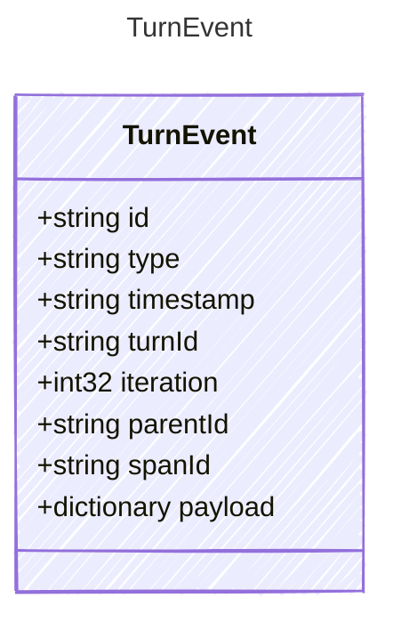

<!-- <auto-generated by typra-emitter> -->

A canonical event envelope emitted by the turn harness. The payload is kept
JSON-shaped so runtimes can load all events even when newer payload types are
added; event-specific typed payload models below define the canonical shapes.

## Class Diagram



## Yaml Example

```yaml
id: evt_abc123
timestamp: 2026-06-09T20:00:00Z
turnId: turn_001
iteration: 0
parentId: evt_parent
spanId: span_tool_001
```

## Properties

| Name | Type | Description |
| ---- | ---- | ----------- |
| id | string | Unique identifier for this event |
| type | string | Event type discriminator |
| timestamp | string | ISO 8601 UTC timestamp when the event was emitted |
| turnId | string | Stable identifier for the outer turn |
| iteration | int32 | Zero-based agent-loop iteration associated with the event |
| parentId | string | Parent event or span identifier for reconstructing event hierarchy |
| spanId | string | Trace span identifier associated with this event |
| payload | dictionary | Event-specific payload. Use the typed payload model matching 'type'. |
