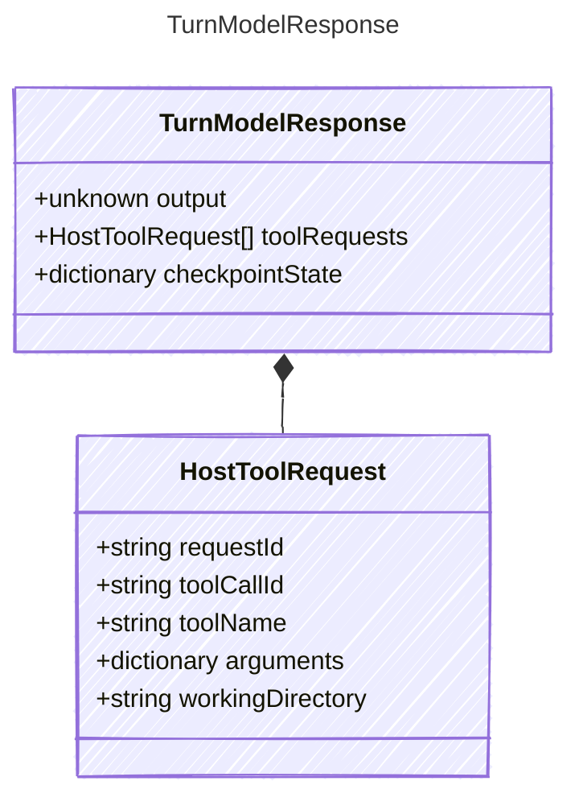

<!-- <auto-generated by typra-emitter> -->

Response returned by the injected model callback to the reference turn runner.

## Class Diagram

## Properties

| Name | Type | Description |
| ---- | ---- | ----------- |
| output | unknown | Provider-neutral final model output for the turn when no more tools are requested |
| toolRequests | [HostToolRequest[]](../hosttoolrequest/) | Host tool execution requests emitted by the model callback |
| checkpointState | dictionary | Additional deterministic state to merge into the iteration checkpoint |

## Composed Types

The following types are composed within `TurnModelResponse`:

- [HostToolRequest](../hosttoolrequest/)
