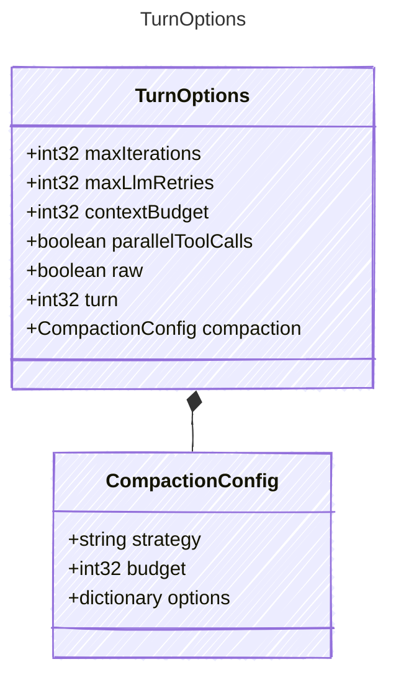

<!-- <auto-generated by typra-emitter> -->

Configuration for the agent loop's turn() function. Controls iteration
limits, retry policy, context management, and execution behavior.

Runtimes accept these as either a TurnOptions object or individual
keyword/named parameters — the TypeSpec model defines the canonical
field set.

## Class Diagram



## Yaml Example

```yaml
maxIterations: 10
maxLlmRetries: 3
contextBudget: 100000
parallelToolCalls: true
raw: false
turn: 1
compaction:
  strategy: summarize
```

## Properties

| Name | Type | Description |
| ---- | ---- | ----------- |
| maxIterations | int32 | Maximum number of tool-call iterations before the loop terminates |
| maxLlmRetries | int32 | Maximum number of LLM call retries on transient failure within a single iteration |
| contextBudget | int32 | Character budget for the context window. When set, the loop trims older messages to stay within budget before each LLM call. System messages are never dropped. |
| parallelToolCalls | boolean | Whether to execute multiple tool calls concurrently when the LLM returns several in one response |
| raw | boolean | When true, return the raw LLM response without processor post-processing |
| turn | int32 | Turn number for trace labeling. Useful when the caller maintains an outer conversation loop. |
| compaction | [CompactionConfig](../compactionconfig/) | Context compaction configuration. Controls how messages are summarized when the context window exceeds the budget. |

## Composed Types

The following types are composed within `TurnOptions`:

- [CompactionConfig](../compactionconfig/)
