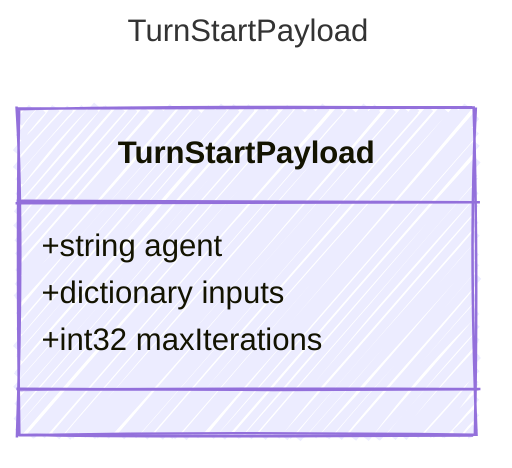

<!-- <auto-generated by typra-emitter> -->

Payload for "turn_start" events — a turn is beginning.

## Class Diagram



## Yaml Example

```yaml
agent: weather-agent
maxIterations: 10
```

## Properties

| Name | Type | Description |
| ---- | ---- | ----------- |
| agent | string | Name of the loaded prompt/agent, when available |
| inputs | dictionary | Input values supplied to the turn after host-side sanitization |
| maxIterations | int32 | Configured maximum tool-call iterations |
