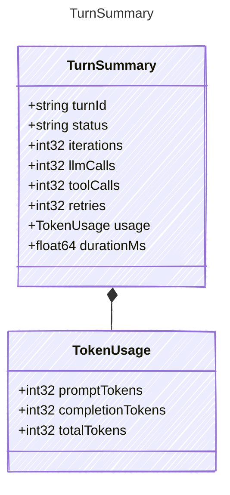

<!-- <auto-generated by typra-emitter> -->

Summary statistics for a completed turn trace.

## Class Diagram



## Yaml Example

```yaml
turnId: turn_001
status: success
iterations: 2
llmCalls: 3
toolCalls: 2
retries: 1
durationMs: 2500
```

## Properties

| Name | Type | Description |
| ---- | ---- | ----------- |
| turnId | string | Stable identifier for the outer turn |
| status | string | Final turn status: 'success', 'error', or 'cancelled' |
| iterations | int32 | Number of agent-loop iterations |
| llmCalls | int32 | Number of LLM calls made during the turn |
| toolCalls | int32 | Number of tool calls dispatched during the turn |
| retries | int32 | Number of retry events during the turn |
| usage | [TokenUsage](../tokenusage/) | Aggregated token usage for the turn |
| durationMs | float64 | Total elapsed turn duration in milliseconds |

## Composed Types

The following types are composed within `TurnSummary`:

- [TokenUsage](../tokenusage/)
