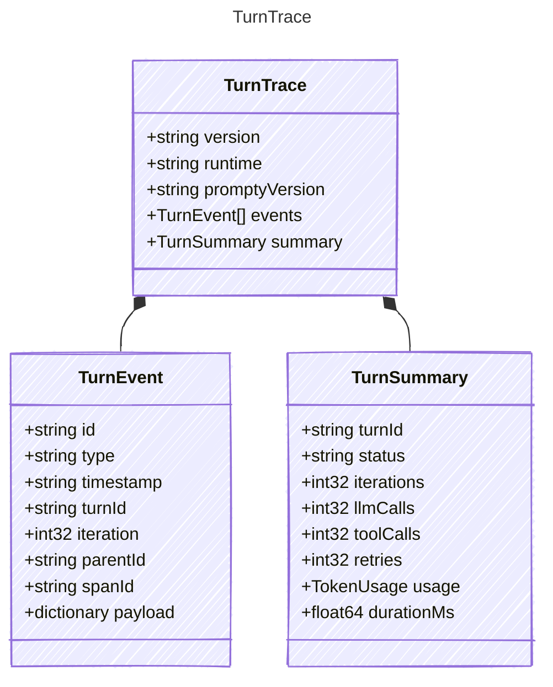

<!-- <auto-generated by typra-emitter> -->

Portable JSONL/replay container for a recorded turn harness run.

## Class Diagram



## Yaml Example

```yaml
version: "1"
runtime: typescript
promptyVersion: 2.0.0
```

## Properties

| Name | Type | Description |
| ---- | ---- | ----------- |
| version | string | Trace schema version |
| runtime | string | Runtime name that produced the trace |
| promptyVersion | string | Prompty library version that produced the trace |
| events | [TurnEvent[]](../turnevent/) | Recorded turn events in emission order |
| summary | [TurnSummary](../turnsummary/) | Optional summary computed from the event stream |

## Composed Types

The following types are composed within `TurnTrace`:

- [TurnEvent](../turnevent/)
- [TurnSummary](../turnsummary/)
