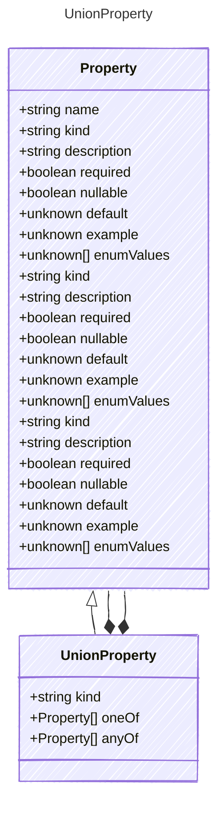

<!-- <auto-generated by typra-emitter> -->

Represents a JSON Schema union property.

Use `oneOf` when exactly one branch must match, or `anyOf` when one or more
branches may match. The alternatives are full Prompty properties so unions
remain portable across generated runtimes.

## Class Diagram



## Yaml Example

```yaml
oneOf:
  - kind: string
  - kind: integer
anyOf:
  - kind: string
  - kind: boolean
```

## Properties

| Name | Type | Description |
| ---- | ---- | ----------- |
| kind | string |  |
| oneOf | [Property[]](../property/) | Alternative property schemas where exactly one branch must match |
| anyOf | [Property[]](../property/) | Alternative property schemas where one or more branches may match |

## Composed Types

The following types are composed within `UnionProperty`:

- [Property](../property/)
- [Property](../property/)
