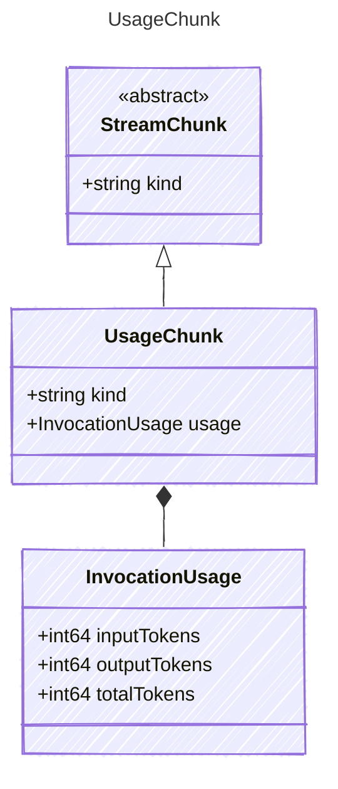

<!-- <auto-generated by typra-emitter> -->

Cumulative token usage emitted once after provider content and tool chunks.

## Class Diagram

## Properties

| Name | Type | Description |
| ---- | ---- | ----------- |
| kind | string | The kind identifier for usage chunks |
| usage | [InvocationUsage](../invocationusage/) | Complete cumulative token usage for the completed provider invocation |

## Composed Types

The following types are composed within `UsageChunk`:

- [InvocationUsage](../invocationusage/)
