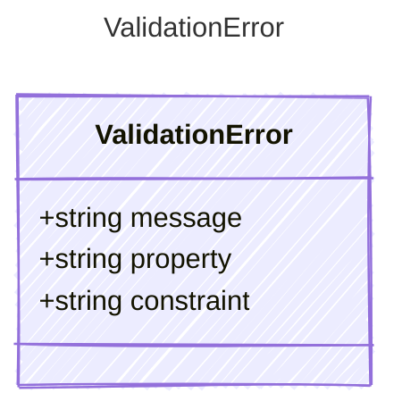

<!-- <auto-generated by typra-emitter> -->

Raised when input validation fails. Each ValidationError describes a
single property that did not satisfy its constraint.

## Class Diagram



## Yaml Example

```yaml
message: "Missing required input: firstName"
property: firstName
constraint: required
```

## Properties

| Name | Type | Description |
| ---- | ---- | ----------- |
| message | string | Human-readable error message |
| property | string | The name of the property that failed validation |
| constraint | string | The constraint that was violated (e.g., 'required', 'type') |
