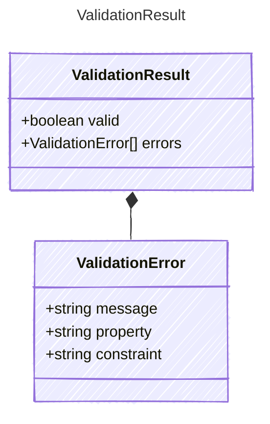

<!-- <auto-generated by typra-emitter> -->

The result of validating inputs against a Prompty's inputs.
Returned by `validate_inputs` (§12.2) to indicate whether all
required inputs are present and satisfy their constraints.

## Class Diagram



## Yaml Example

```yaml
valid: true
errors: []
```

## Properties

| Name | Type | Description |
| ---- | ---- | ----------- |
| valid | boolean | Whether all inputs passed validation |
| errors | [ValidationError[]](../validationerror/) | List of validation errors (empty when valid is true) |

## Composed Types

The following types are composed within `ValidationResult`:

- [ValidationError](../validationerror/)
