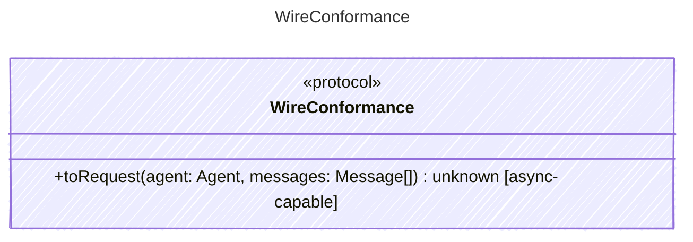

<!-- <auto-generated by typra-emitter> -->

Conformance-only seam that hosts the provider wire-mapping behavior vectors.
Mapping canonical agent + messages into a provider-specific request body is
validated identically across every runtime.

This interface exists purely to carry

## Class Diagram

## Helper Methods

The following helper methods are declared via `@method` and must be implemented by every runtime. The schema declares the logical protocol contract; each runtime maps async-capable methods to idiomatic sync/async shapes for that language.

| Name | Signature | Runtime shape | Description |
| ---- | --------- | ------------- | ----------- |
| `toRequest` | `toRequest(agent: Agent, messages: Message[]) -> unknown` | async-capable | Build the provider-specific wire request body from canonical inputs |
