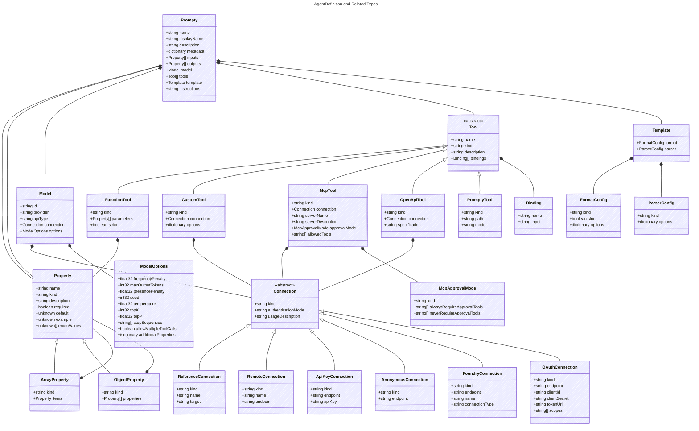

The following diagram illustrates the types and their relationships in the Prompty schema.
The root type is [Prompty](prompty/) — this is what a `.prompty` file becomes when loaded.

```mermaid
---
title: AgentDefinition and Related Types
config:
  look: handDrawn
  theme: colorful
  class:
    hideEmptyMembersBox: true
---
classDiagram
    class Property {
      
        +string name
        +string kind
        +string description
        +boolean required
        +unknown default
        +unknown example
        +unknown[] enumValues
    }
    class ObjectProperty {
      
        +string kind
        +Property[] properties
    }
    class ArrayProperty {
      
        +string kind
        +Property items
    }
    class Connection {
      <<abstract>>
        +string kind
        +string authenticationMode
        +string usageDescription
    }
    class ReferenceConnection {
      
        +string kind
        +string name
        +string target
    }
    class RemoteConnection {
      
        +string kind
        +string name
        +string endpoint
    }
    class ApiKeyConnection {
      
        +string kind
        +string endpoint
        +string apiKey
    }
    class AnonymousConnection {
      
        +string kind
        +string endpoint
    }
    class FoundryConnection {
      
        +string kind
        +string endpoint
        +string name
        +string connectionType
    }
    class OAuthConnection {
      
        +string kind
        +string endpoint
        +string clientId
        +string clientSecret
        +string tokenUrl
        +string[] scopes
    }
    class ModelOptions {
      
        +float32 frequencyPenalty
        +int32 maxOutputTokens
        +float32 presencePenalty
        +int32 seed
        +float32 temperature
        +int32 topK
        +float32 topP
        +string[] stopSequences
        +boolean allowMultipleToolCalls
        +dictionary additionalProperties
    }
    class Model {
      
        +string id
        +string provider
        +string apiType
        +Connection connection
        +ModelOptions options
    }
    class Binding {
      
        +string name
        +string input
    }
    class Tool {
      <<abstract>>
        +string name
        +string kind
        +string description
        +Binding[] bindings
    }
    class FunctionTool {
      
        +string kind
        +Property[] parameters
        +boolean strict
    }
    class CustomTool {
      
        +string kind
        +Connection connection
        +dictionary options
    }
    class McpApprovalMode {
      
        +string kind
        +string[] alwaysRequireApprovalTools
        +string[] neverRequireApprovalTools
    }
    class McpTool {
      
        +string kind
        +Connection connection
        +string serverName
        +string serverDescription
        +McpApprovalMode approvalMode
        +string[] allowedTools
    }
    class OpenApiTool {
      
        +string kind
        +Connection connection
        +string specification
    }
    class PromptyTool {
      
        +string kind
        +string path
        +string mode
    }
    class FormatConfig {
      
        +string kind
        +boolean strict
        +dictionary options
    }
    class ParserConfig {
      
        +string kind
        +dictionary options
    }
    class Template {
      
        +FormatConfig format
        +ParserConfig parser
    }
    class Prompty {
      
        +string name
        +string displayName
        +string description
        +dictionary metadata
        +Property[] inputs
        +Property[] outputs
        +Model model
        +Tool[] tools
        +Template template
        +string instructions
    }
    Property <|-- ArrayProperty
    Property <|-- ObjectProperty
    Connection <|-- ReferenceConnection
    Connection <|-- RemoteConnection
    Connection <|-- ApiKeyConnection
    Connection <|-- AnonymousConnection
    Connection <|-- FoundryConnection
    Connection <|-- OAuthConnection
    Tool <|-- FunctionTool
    Tool <|-- CustomTool
    Tool <|-- McpTool
    Tool <|-- OpenApiTool
    Tool <|-- PromptyTool
    ObjectProperty *-- Property
    ArrayProperty *-- Property
    Model *-- Connection
    Model *-- ModelOptions
    Tool *-- Binding
    FunctionTool *-- Property
    CustomTool *-- Connection
    McpTool *-- Connection
    McpTool *-- McpApprovalMode
    OpenApiTool *-- Connection
    Template *-- FormatConfig
    Template *-- ParserConfig
    Prompty *-- Property
    Prompty *-- Property
    Prompty *-- Model
    Prompty *-- Tool
    Prompty *-- Template
```
