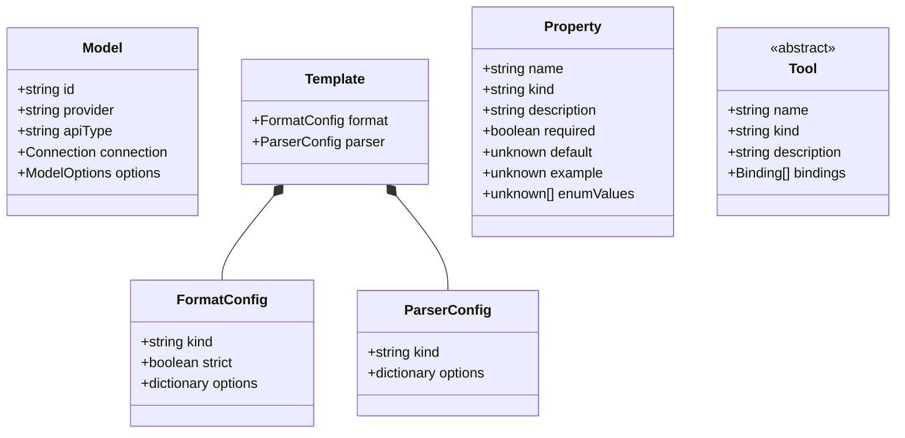
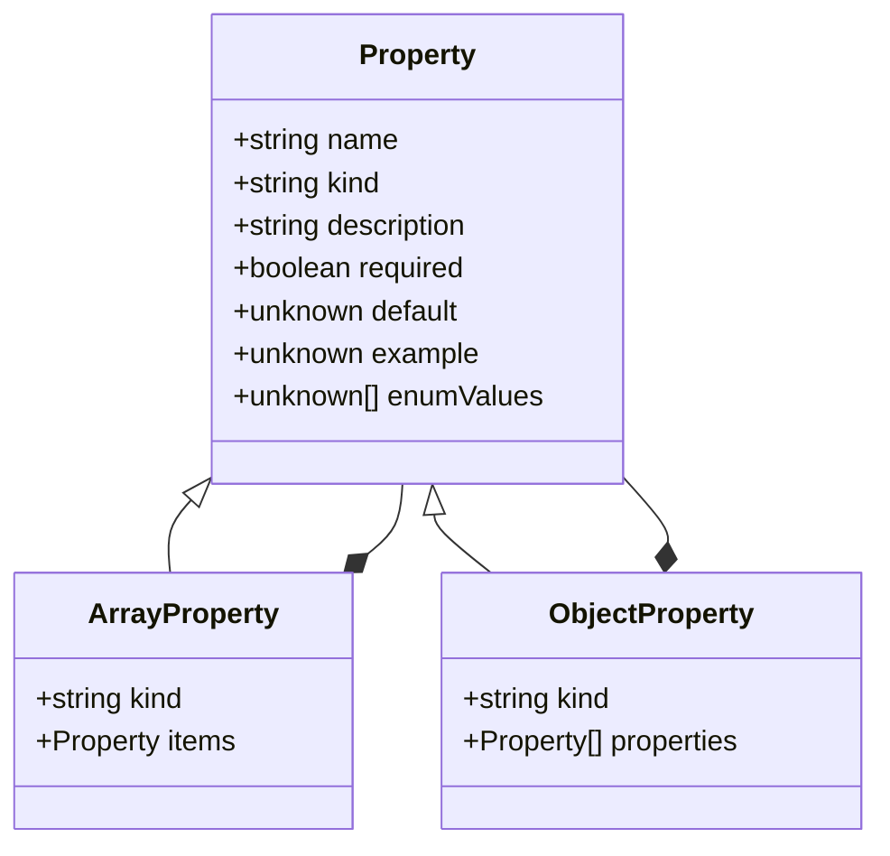
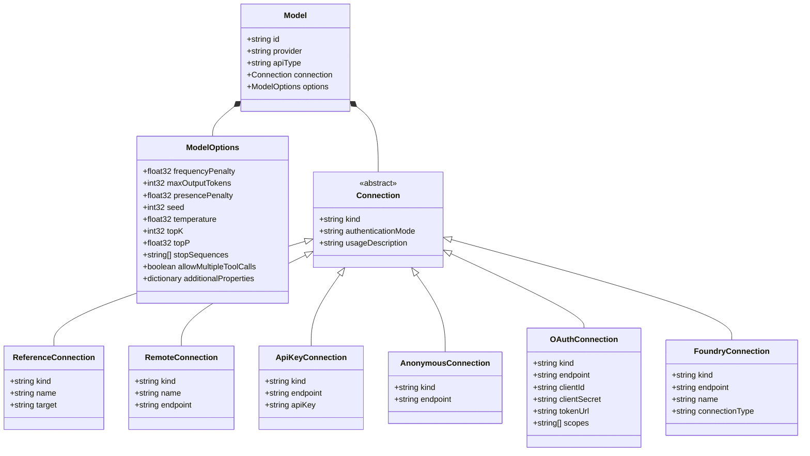
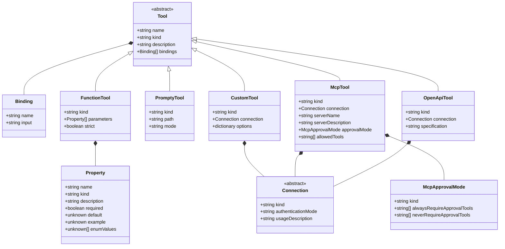
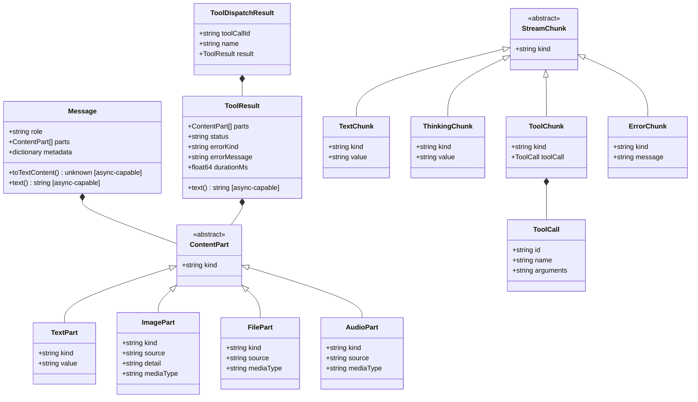
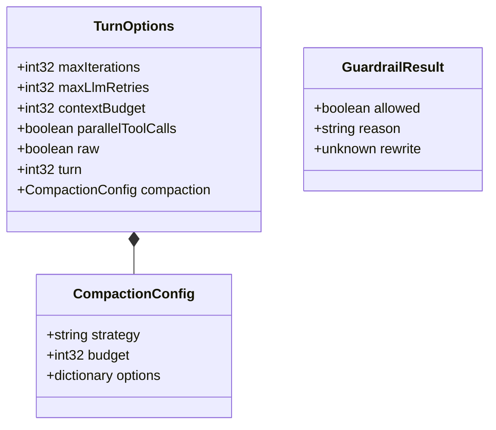
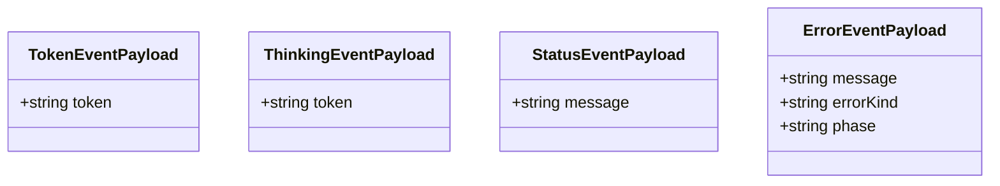
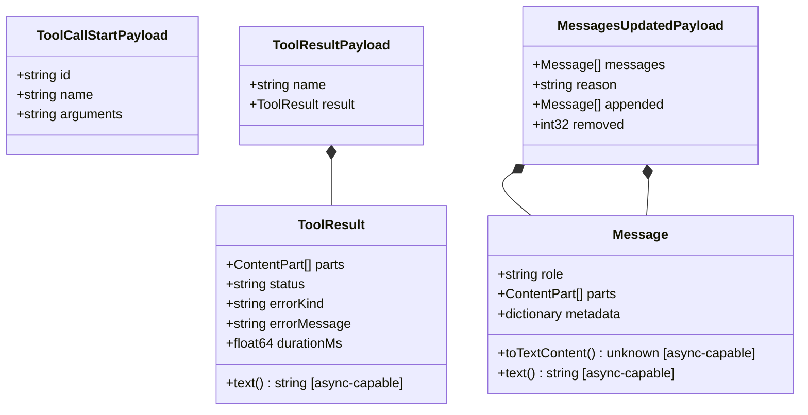
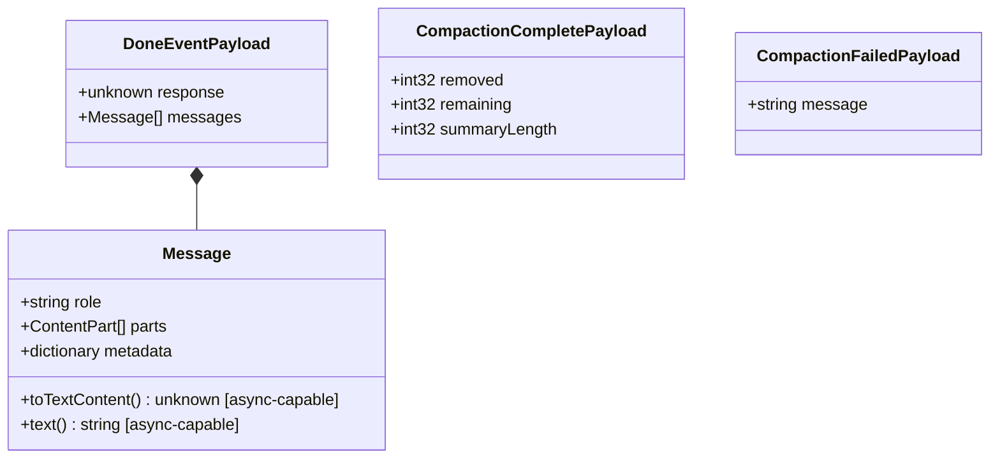

This reference is generated from the in-repository TypeSpec model under
`schema/model/`. It documents the Prompty data model: the fields accepted in
`.prompty` frontmatter, runtime configuration objects, tool definitions,
message shapes, protocol contracts, events, and provider wire helper types.

Use this page for a map of the schema. Use each type page for field details,
examples, child types, helper methods, and alternate constructions. For public
functions, see the [API Reference](/api-reference/). Runtime behavior for these
types is specified in the [Prompty Specification](/specification/).

## Source of Truth

- Type shapes are defined in `schema/model/**/*.tsp`.
- Generated runtime models are checked in under each runtime's `model`
  directory.
- Generated Markdown reference pages are checked in here under
  `web/src/content/docs/reference/`.
- If a generated page looks stale, update the TypeSpec or emitter and run
  `cd schema && npm run build` rather than editing generated reference pages
  by hand.

## Prompt File Core

## Properties and Schemas

## Models and Connections

## Tools

## Messages, Tool Calls, and Streaming

## Agentic Runtime Controls

## Token and Status Events

## Tool and Message Events

## Turn Completion and Compaction Events

