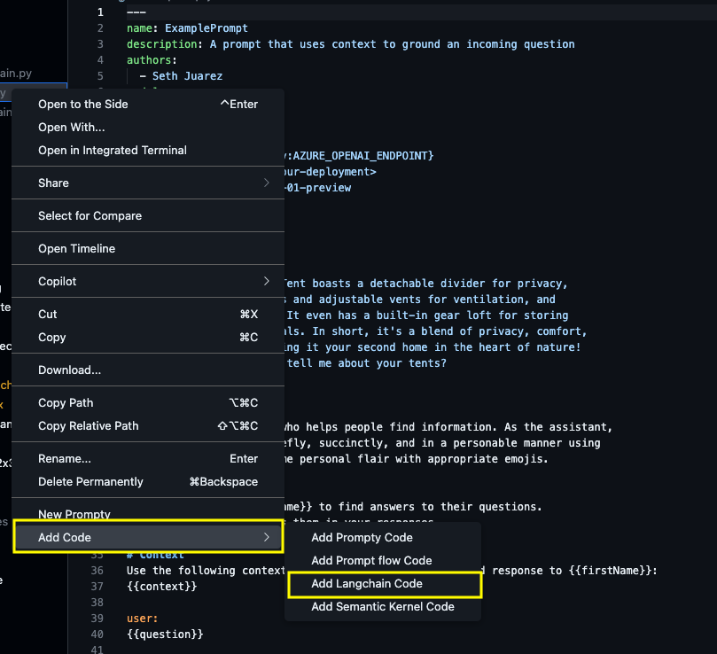

This guide explains how to use Prompty templates with the [LangChain framework](https://python.langchain.com/docs/introduction/) and the [langchain-prompty](https://python.langchain.com/api_reference/prompty/) integration, to build generative AI applications.

---

## What is LangChain

[LangChain](https://python.langchain.com/docs/introduction/) is a composable framework for building context-aware, reasoning applications pwoered by large language models, and using your organization's data and APIs. It has an [extensive set of integrations](https://python.langchain.com/docs/integrations/providers/) with both plaforms ([like AzureAI](https://python.langchain.com/api_reference/azure_ai/)) and tools (like [Prompty](https://python.langchain.com/docs/integrations/providers/microsoft/)) - allowing you to work seamlessly with a diverse set of model providers and integrations.

> Explore these resources ·  [Microsoft Integrations](https://python.langchain.com/docs/integrations/providers/microsoft/) · [`langchain-prompty` docs](https://python.langchain.com/api_reference/prompty/) ·  [`langchain-prompty` package](https://pypi.org/project/langchain-prompty/) ·  [`langchain-prompty` source](https://github.com/langchain-ai/langchain/tree/master/libs/partners/prompty) 

In this section, we'll show you how to get started using Prompty with LangChain - and leave you with additional resources for self-guided exploration.

---

## Pre-Requisites

We'll use the [`langchain-prompty`](https://python.langchain.com/api_reference/prompty/) Python API with an OpenAI model. You will need:

1. A development environment with Python3 (3.11+ recommended)
1. A Visual Studio Code editor with [Prompty Extension](https://marketplace.visualstudio.com/items?itemName=ms-toolsai.prompty) installed
1. An OpenAI developer account with an API key you can use from code.
    - Get: Create an API-KEY using [OpenAI Settings](https://platform.openai.com/settings/organization/api-keys)
    - Set: Use it as the value for an `OPENAI_API_KEY` environment variable.
1. LangChain python packages for OpenAI and Prompty:
    - Use: ```pip install -qU "langchain[openai]"```
    - Use: ```pip install -U langchain-prompty``` 

Let's get started!

---

## Quickstart: Hello, LangChain!

Let's start with a basic LangChain application example [using Language models](https://python.langchain.com/docs/tutorials/llm_chain/#using-language-models). This lets us validate the LangChain setup is working before we try using Prompty.

**IMPORTANT**: 

1. On that page, pick **Select chat model: `OpenAI`** in the dropdown.

1. Next, install the `langchain[openai]` package using this command:

    ``` 
    pip install -qU "langchain[openai]"
    ```

1. Now create a new file called `hello_langchain.py` in the local directory.
1. Copy over this code (adapted from the sample provided there)

    ```python
    import getpass
    import os

    if not os.environ.get("OPENAI_API_KEY"):
      os.environ["OPENAI_API_KEY"] = getpass.getpass("Enter API key for OpenAI: ")

    from langchain.chat_models import init_chat_model

    model = init_chat_model("gpt-4o-mini", model_provider="openai")

    # Added lines for simple test
    response = model.invoke("What can you tell me about your tents? Respond in 1 paragraph.")
    print(response.content)
    ```

1. Run the application using this command:

    ```
    python3 hello_langchain.py
    ```

1. If you had not previously set the ``OPENAI_API_KEY` env variable in that terminal, you will now be prompted to enter it as the "Password" input interactively.

On successful run, you should see a valid text response. Here's some sample:

```txt
Our tents are designed for durability, comfort, and ease of setup....
```

and

```txt
I don't sell products or own physical items, so I don't have any tents to offer.....
```

This is a generic response to that question. What if we wanted to _customize_ the response with our template and data? This is where Prompty can help.

---

## Using: LangChain-Prompty

Let's look at the [langchain-prompty](https://pypi.org/project/langchain-prompty/) quickstart. You can also see the guidance in the [package README](https://github.com/langchain-ai/langchain/tree/master/libs/partners/prompty).

1. First, install the `langchain-prompty` package:

    ```
    pip install -U langchain-prompty
    ```

The [`create_chat_prompt` function](https://python.langchain.com/api_reference/prompty/langchain/langchain_prompty.langchain.create_chat_prompt.html#langchain_prompty.langchain.create_chat_prompt) creates a chat prompt from a Langchain schema and returns a `Runnable` object. We can then use [the pipe operator](https://python.langchain.com/docs/how_to/sequence/#the-pipe-operator-) to chain Runnables (input, prompt, model, output) as desired, to orchestrate the end-to-end workflow. 

Let's use this to refactor our previous example to use Prompty.

1. Create a `hello.prompty` file with a basic prompt template as shown:

    ```yaml
    ---
    name: Basic Prompt
    description: A basic prompt that uses the GPT-3 chat API to answer questions
    authors:
      - author_1
      - author_2
    model:
      api: chat
      configuration:
        azure_deployment: gpt-4o-mini
    sample:
      firstName: Jane
      lastName: Doe
      question: Tell me about your tents
      context: >
        The Alpine Explorer Tent boasts a detachable divider for privacy, 
        numerous mesh windows and adjustable vents for ventilation, and 
        a waterproof design. It even has a built-in gear loft for storing 
        your outdoor essentials. In short, it's a blend of privacy, comfort, and convenience, making it your second home in the heart of nature!
    ---
    system:
    You are an AI assistant who helps people find information. As the assistant, 
    you answer questions briefly, succinctly, and in a personable manner using 
    markdown and even add some personal flair with appropriate emojis.

    Also add in dad jokes related to tents and outdoors when you begin your response to {{firstName}}.

    # Customer
    You are helping {{firstName}} to find answers to their questions.
    Use their name to address them in your responses.

    # Context
    Use the following context to provide a more personalized response to {{firstName}}:
    {{context}}

    user:
    {{question}}
    ```

1. Create a `hello_prompty.py` file in the same folder, with this code:

    ```python
    import getpass
    import os

    if not os.environ.get("OPENAI_API_KEY"):
        os.environ["OPENAI_API_KEY"] = getpass.getpass("Enter API key for OpenAI: ")

    from langchain.chat_models import init_chat_model
    model = init_chat_model("gpt-4o-mini", model_provider="openai")

    from pathlib import Path
    folder = Path(__file__).parent.absolute().as_posix()

    from langchain_prompty import create_chat_prompt
    prompt = create_chat_prompt(folder + "/hello.prompty")

    from langchain_core.output_parsers import StrOutputParser
    parser = StrOutputParser()

    chain = prompt | model | parser
    response =chain.invoke({"input":'''{"question": "Tell me about your tents", "firstName": "Jane", "lastName": "Doe"}'''}) 
    print(response)
    ```

1. Run the application above from the command line.

    ```
    python3 hello_prompty.py
    ```

1. You should see a response that looks something like this:

    ```
    Hey Jane! 🌼 Did you hear about the guy who invented Lifesavers? He made a mint! 

    Now, as for tents, if you mean camping tents, they typically come in various shapes and sizes, including dome, tunnel and pop-up styles! They can be waterproof, have multiple rooms, or even be super easy to set up. What kind of adventure are you planning? 🏕️
    ```

_Compare the code to the previous version_ - do you see the changes that help you move from inline question to a prompt template? You can now modify the Prompty template and re-run the script to iterate quickly on your prototype.

---

## Using: VS Code Extension

The Prompty Visual Studio Code extension helps you manage the creation and execution of Prompty assets within your IDE, helping speed up the inner loop for your development workflow. Read the [Prompty Extension Guide](/guides/extension/) for a more detailed explainer on how the create your first prompty.

In _this_ section, we'll focus on using the extension to convert the `.prompty` file to Langchain code, and get a running application out of the box, for customization later.


1. Make sure you have already completed the previous steps of this tutorial. This ensures that your VS Code environment has the required Langchain python packages installed.

1. Create a new `basic.prompty` file by using the Visual Studio Code extension **New Prompty** option in the dropdown menu. You should see something like this:

    ```yaml
    ---
    name: ExamplePrompt
    description: A prompt that uses context to ground an incoming question
    authors:
      - Seth Juarez
    model:
      api: chat
      configuration:
        type: azure_openai
        azure_endpoint: ${env:AZURE_OPENAI_ENDPOINT}
        azure_deployment: <your-deployment>
        api_version: 2024-07-01-preview
      parameters:
        max_tokens: 3000
    sample:
      firstName: Seth
      context: >
        The Alpine Explorer Tent boasts a detachable divider for privacy, 
        numerous mesh windows and adjustable vents for ventilation, and 
        a waterproof design. It even has a built-in gear loft for storing 
        your outdoor essentials. In short, it's a blend of privacy, comfort, 
        and convenience, making it your second home in the heart of nature!
      question: What can you tell me about your tents?
    ---

    system:
    You are an AI assistant who helps people find information. As the assistant, 
    you answer questions briefly, succinctly, and in a personable manner using 
    markdown and even add some personal flair with appropriate emojis.

    # Customer
    You are helping {{firstName}} to find answers to their questions.
    Use their name to address them in your responses.

    # Context
    Use the following context to provide a more personalized response to {{firstName}}:
    {{context}}

    user:
    {{question}}
    ```

1. Select that `basic.prompty` file in your VS Code File Explorer and click for the drop-down menu. You should now see options to `Add Code` as shown below.

    

1. Select the `Add Langchain Code` option. You should now see a `basic_langchain.py` file created for you in the local folder. It should look something like this:

    ```python
    import getpass
    import os
    import json

    from langchain_core.output_parsers import StrOutputParser
    from langchain_core.prompts import ChatPromptTemplate
    from langchain_openai import ChatOpenAI

    # pip install langchain-prompty
    from langchain_prompty import create_chat_prompt
    from pathlib import Path

    # load prompty as langchain ChatPromptTemplate
    # Important Note: Langchain only support mustache templating. Add 
    #  template: mustache
    # to your prompty and use mustache syntax.
    folder = Path(__file__).parent.absolute().as_posix()
    path_to_prompty = folder + "/basic.prompty"
    prompt = create_chat_prompt(path_to_prompty)

    os.environ["OPENAI_API_KEY"] = getpass.getpass()
    model = ChatOpenAI(model="gpt-4")


    output_parser = StrOutputParser()

    chain = prompt | model | output_parser

    json_input = '''{
      "firstName": "Seth",
      "context": "The Alpine Explorer Tent boasts a detachable divider for privacy,  numerous mesh windows and adjustable vents for ventilation, and  a waterproof design. It even has a built-in gear loft for storing  your outdoor essentials. In short, it's a blend of privacy, comfort,  and convenience, making it your second home in the heart of nature!\\n",
      "question": "What can you tell me about your tents?"
    }'''
    args = json.loads(json_input)
    result = chain.invoke(args)
    print(result)
   
    ```

1. Run the file using the command:

    ```
    python basic_langchain.py
    ```

1. You should see a valid response like this:

    ```
    Hello Seth! 👋

    Our key tent offering at the moment is the Alpine Explorer Tent. It's quite the ultimate companion for your outdoor adventures! 🏕️

    Here's a quick rundown of its features:
    - It has a **detachable divider**, offering the option for privacy when needed. Perfect when camping with friends or family.
    - Numerous **mesh windows and adjustable vents** help ensure ventilation, keeping the interior fresh and cool. No need to worry about stuffiness!
    - The Alpine Explorer Tent is **waterproof**, so you're covered, literally and figuratively, when those unexpected rain showers happen.
    - It even has a **built-in gear loft** for storing your outdoor essentials. So you won't be fumbling around in the dark for your torchlight or that bag of marshmallows! 

    In short, our tent is designed to provide a blend of privacy, comfort, and convenience, making it your second home in the heart of nature! 🏞️😊

    Is there anything specific you want to know about it, Seth?
    ```

> **Observe the following**

1. The code is similar to the previous step, with minor differences in setting the default model and input arguments.
1. The prompty asset includes default `context`, providing grounding for the response. This example shows how to extend the sample for retrieval augmented generation with inputs from other service integrations.
1. The process demonstrates how parameters are overridden from asset to runtime. The asset specifies defaults for the model configuration (`azure_openai`), but the execution chain uses a different model (`openai`), which takes precedence.

> **For Reference** - the prompty and python files described in this tutorial are also available as file assets under the `web/docs/assets/code` folder in the codebase.> 

---

## Next Steps

Congratulations! You just learned how to use Prompty with LangChain to orchestrate more complex workflows! For your next steps, try one of the following:

1. Take the examples from the previous steps and update them to use a different model provider or configuration. For instance, [select a different chat model](https://python.langchain.com/docs/how_to/sequence/#the-pipe-operator-) from the drop-down and use that as your starter code for loading the Prompty asset. _What did you observe?_
1. Explore the [How-to guides](https://python.langchain.com/docs/how_to/) for other examples that extend the capabilities further. For instance, explore streaming chat (with history) or understand how to chain other prompts to create more complex workflows.


---
[Want to Contribute To the Project?](/contributing/) - _Updated Guidance Coming Soon_.
