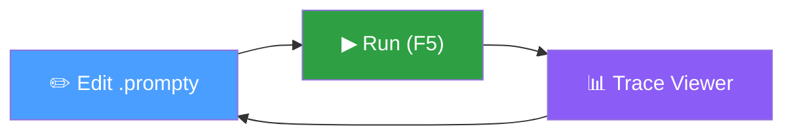

import { Aside, LinkCard, CardGrid } from '@astrojs/starlight/components';

The **Prompty VS Code extension** is the primary tool for authoring, running,
and debugging `.prompty` files. It includes a built-in TypeScript runtime — no
Python installation is required.



## What's in the Extension

| Area | Capabilities |
|---|---|
| **Language support** | TextMate grammar, language server (validation, completion, hover, semantic tokens, document symbols) |
| **Connections** | Manage OpenAI, Anthropic, and Microsoft Foundry connections with secure secret storage |
| **Execution** | Run prompts, preview rendered output, interactive chat mode for thread-based prompts |
| **Traces** | `.tracy` file format with a full React-based trace viewer |
| **Extensibility** | API for other extensions to register providers, executors, and processors |

## Installation

Install from the VS Code Marketplace:

1. Open VS Code
2. Press `Ctrl+Shift+X` (or `Cmd+Shift+X` on macOS) to open Extensions
3. Search for **Prompty**
4. Click **Install** on the extension by **ms-toolsai**

Or install from the command line:

```bash
code --install-extension ms-toolsai.prompty
```

<Aside type="tip">
  The extension ID is `ms-toolsai.prompty`. You can also find it in the
  [Visual Studio Marketplace](https://marketplace.visualstudio.com/items?itemName=ms-toolsai.prompty).
</Aside>

## Next Steps

<CardGrid>
  <LinkCard title="Connections" href="/vscode/connections/" description="Set up OpenAI, Anthropic, or Microsoft Foundry" />
  <LinkCard title="Editing" href="/vscode/editing/" description="Language support, creating files, snippets" />
  <LinkCard title="Running & Preview" href="/vscode/running/" description="Execute prompts and live preview" />
  <LinkCard title="Chat Mode" href="/vscode/chat/" description="Interactive multi-turn conversations" />
  <LinkCard title="Tracing" href="/vscode/tracing/" description="Inspect execution traces" />
  <LinkCard title="Reference" href="/vscode/reference/" description="Settings, shortcuts, API, troubleshooting" />
</CardGrid>