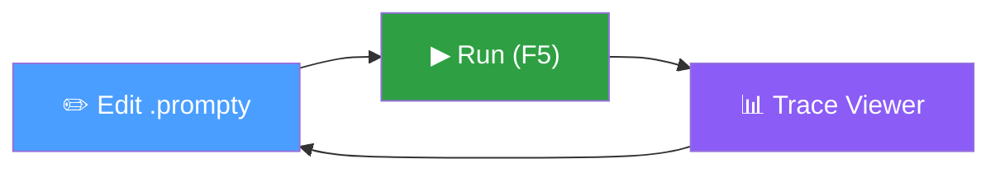

import { Aside, LinkCard, CardGrid } from '@astrojs/starlight/components';

The **Prompty VS Code extension** is the primary tool for authoring, running,
and debugging `.prompty` files. It includes a built-in TypeScript runtime — no
Python installation is required.



## What's in the Extension

| Area | Capabilities |
|---|---|
| **Language support** | TextMate grammar, language server (validation, completion, hover, semantic tokens, document symbols) |
| **Connections** | Manage OpenAI, Anthropic, and Microsoft Foundry connections with secure secret storage |
| **Execution** | Run prompts, preview rendered output, interactive chat mode for thread-based prompts |
| **Traces** | `.tracy` file format with a full React-based trace viewer |
| **Extensibility** | API for other extensions to register providers, executors, and processors |

## Installation

<Aside type="caution" title="v2 not yet on the Marketplace">
  The **v2 extension** is not yet published to the VS Code Marketplace — the
  Marketplace version is still v1. To get the latest v2 build, download the
  `.vsix` artifact from GitHub CI and install it manually (see below).
</Aside>

### From a .vsix file (recommended for v2)

1. Go to the [GitHub Actions — VS Code Extension build](https://github.com/microsoft/prompty/actions/workflows/prompty-vscode.yml) page
2. Click the most recent successful run
3. Download the **vscode-vsix** artifact (a `.zip` containing the `.vsix`)
4. Extract the `.vsix` file from the zip
5. In VS Code, open the Command Palette (`Ctrl+Shift+P`) and run
   **Extensions: Install from VSIX…**, then select the file

Or install from the command line:

```bash
code --install-extension prompty-0.0.0.vsix
```

<Aside type="tip">
  If you have the v1 extension installed, VS Code will automatically replace it
  with the `.vsix` version. You may need to reload the window afterward.
</Aside>

### From the Marketplace (v1)

Once the v2 extension is published, you'll be able to install it directly:

1. Open VS Code
2. Press `Ctrl+Shift+X` (or `Cmd+Shift+X` on macOS) to open Extensions
3. Search for **Prompty**
4. Click **Install** on the extension by **ms-toolsai**

```bash
code --install-extension ms-toolsai.prompty
```

## Next Steps

<CardGrid>
  <LinkCard title="Connections" href="/vscode/connections/" description="Set up OpenAI, Anthropic, or Microsoft Foundry" />
  <LinkCard title="Editing" href="/vscode/editing/" description="Language support, creating files, snippets" />
  <LinkCard title="Running & Preview" href="/vscode/running/" description="Execute prompts and live preview" />
  <LinkCard title="Chat Mode" href="/vscode/chat/" description="Interactive multi-turn conversations" />
  <LinkCard title="Tracing" href="/vscode/tracing/" description="Inspect execution traces" />
  <LinkCard title="Reference" href="/vscode/reference/" description="Settings, shortcuts, API, troubleshooting" />
</CardGrid>