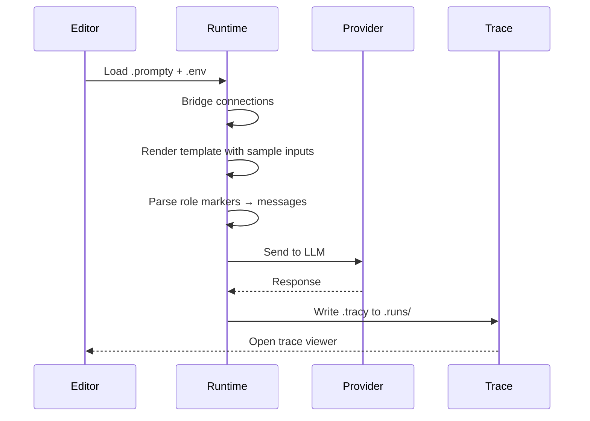

import { Aside } from '@astrojs/starlight/components';


## Running a Prompt

Press **F5** with a `.prompty` file open — or click the **▶ play button** in the
editor title bar. Here's what happens under the hood:



Step by step:

1. **Loads `.env` files** automatically, searching from the file's directory up
   to the workspace root
2. **Bridges sidebar connections** into the built-in TypeScript runtime —
   injecting API keys, endpoints, and credentials as needed
3. **Renders the template** using `default` and `example` values from
   `inputSchema`
4. **Parses role markers** (`system:`, `user:`, `assistant:`) into a message
   list
5. **Sends the messages** to the LLM via the configured connection
6. **Writes a `.tracy` trace file** to the `.runs/` folder in your workspace
7. **Opens the trace viewer** so you can inspect the result

<Aside type="tip">
  If the prompt has an input with `kind: thread`, pressing F5 opens
  **chat mode** instead of a single execution. See
  [Chat Mode](/vscode/chat/) for details.
</Aside>

---

## Live Preview

Click the **preview icon** (split-pane icon) in the editor title bar — or run
**Prompty: Preview** from the Command Palette (`Ctrl+Shift+P`) — to open a live
preview panel beside your editor.

The preview panel shows:

- **Model info** — which model and provider the prompt targets
- **Input summary** — tags showing the sample values that will be used
- **Rendered messages** — the fully rendered conversation with role-colored
  blocks and Markdown formatting

The preview **updates live as you type**. It runs `load()` + `prepare()` only —
no LLM call is made, so it's **free and instant**.

Inputs with `kind: thread` are skipped in preview mode. If rendering fails
(e.g., a Jinja2 syntax error), the preview falls back to showing the raw
instructions.

---

## Environment Variables

The extension loads `.env` files automatically when running or previewing
prompts. You can use `${env:VAR_NAME}` references in your frontmatter, and
they'll be resolved at load time. The search starts from the `.prompty` file's
directory and walks up to the workspace root.

```bash title=".env"
OPENAI_API_KEY=sk-your-key-here
ANTHROPIC_API_KEY=sk-ant-your-key-here
AZURE_AI_PROJECT_ENDPOINT=https://my-project.services.ai.azure.com
```

<Aside type="caution">
  Never commit `.env` files to source control. Add `.env` to your `.gitignore`
  file. API keys stored in sidebar connections use VS Code's SecretStorage and
  are always safe.
</Aside>

You can also set a custom `.env` file path via the `prompty.envFilePath`
setting if your env file isn't in the default search path:

```json title="settings.json"
{
  "prompty.envFilePath": ".env.local"
}
```

---

## Error Handling

The extension surfaces helpful error hints when a prompt execution fails.
Common HTTP errors and what to check:

| Status | Meaning | What to Do |
|---|---|---|
| **401** | Authentication failed | Check that your API key is correct and hasn't expired. Re-enter it with **Edit Connection**. |
| **403** | Forbidden | Verify your account has the required permissions for the model or deployment. |
| **404** | Model / deployment not found | Check the `model.id` in your frontmatter — the model name or deployment ID may be misspelled or not available in your region. |
| **429** | Rate limited | You've hit the provider's rate limit. Wait a moment and retry, or switch to a different model/deployment. |

<Aside type="tip">
  Check the **Output** panel (select **Prompty** from the channel dropdown) for
  the full error response from the provider. This often includes additional
  detail beyond the status code.
</Aside>
